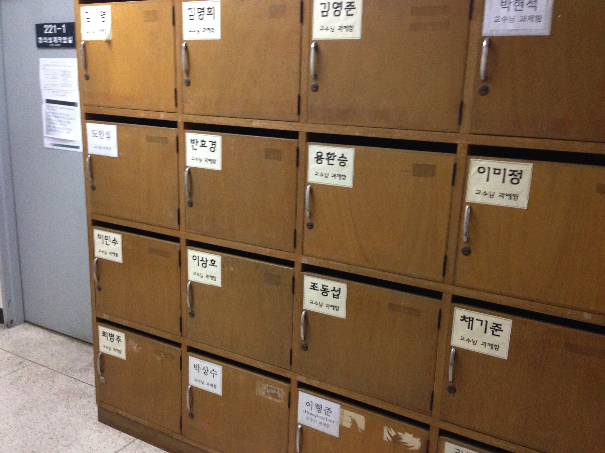
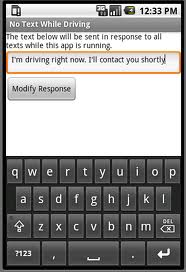

*slide #1*

## Smart Software Project

### Lab: Week 8

### Bluetooth Comm.with Android Dev.

### Prof. HyungJune Lee
#### hyungjune.lee@ewha.ac.kr


*slide #2*

#### Today

- Lab announcement

- Review Lab assignment #4

- SmartCAR with Android device

- Lab assignment #5

- Course announcement


*slide #3*

# Class Schedule

| Week    | Lecture Contents    | Lab Contents                                             |
|---------|---------------------|----------------------------------------------------------|
| Week 1  | Course introduction | Arduino introduction: platform & programming environment |
| Week 2  | Embedded system overview & source management in collaborative repository (using GitHub) | Lab 1: Arduino Mega 2560 board &SmartCAR platform |
| Week 3  | ATmega2560 Micro-controller (MCU): architecture & I/O ports, Analog vs. Digital, Pulse Width Modulation  |Lab 2: SmartCAR LED control |
| Week 4  | Analog vs. Digital & Pulse Width Modulation  |Lab 3: SmartCAR motor control (Due: HW on creating project repository using GitHub) |
| week 5  | ATmega2560 MCU: memory, I/O ports, UART  |Lab 4: SmartCAR control via Android Bluetooth |
| week 6  | ATmega2560 UART control & Bluetooth communication between Arduino platform and Android device  |Lab 5: SmartCAR control through yourown customized Android app (Due: Project proposal) |
| week 7  | Midterm exam |  |
| week 8  | ATmega2560 Timer, Interrupts & Ultrasonic sensors  |Lab 6: SmartCAR ultrasonic sensing |
| week 9  | Infrared sensors & Buzzer  |Lab 7: SmartCAR infrared sensing |
| week 10 | Acquiring location information from Android device & line tracing  |Lab 8: Implementation of line tracer |
| week 11 | Gyroscope, accelerometer, and compass sensors  |Lab 9: Using gyroscope,accelerometer, and compass sensors |
| week 12 | Project | Team meeting (for progress check) |
| week 13 | Project | Team meeting (for progress check) |
| week 14 | Course wrap-up & next steps |  |
| week 15 | Project | presentation & demo I (Due: source code, presentation slides, & poster slide) Project presentation & demo II |
| week 16 | Final week (no final exam) | |





*slide #4*

#### Lab Session

- Practice in-lab programming exercises

- based on the lecture materials

- Upload source codes for lab assignments in Ewha

- Cyber Campus after the lab session

- Due: 11:59pm on the lab day

- Once you are done, you can leave the session

- after checking with me or TA

- Or, continue to work on programming

- for other homework assignments


*slide #5*

#### Lab Policy

1) Please check out your SmartCAR (& Nexus 7 tablet) as soon as you arrive at the classroom

2) Please complete lab assignments

3) Upload required files to Ewha Cyber Campus

4) Check with me or TA

5) Please upload a null firmware to SmartCAR before you return it!!! This will be a part of your lab score

6) Please remove files that you created or downloaded in your computer after you are done Remove your project completely

7) Please shut down your computer before you leave

8) Return the checked-out SmartCAR (& Nexus 7 tablet) to TA


*slide #x*

#### How to run SmartCAR in Lab

- Power OFF

- Compile your code

- Lift up your SmartCAR with your hand

- Upload your code

- Disconnect the USB cable

- Go to find a spacious area

- Put it down there

- Power ON

- It will run your firmware

- After test, turn power OFF


*slide #7*

#### Lab Announcement

* **Bluetooth pairing "headache"**

  * Cause : there are many Bluetooth devices in the classroom with the very similiar same names.
  * **Remedy 1 :** Identify which device is yours by it's hardware ID.
  * **remedy 2 :** Find a place with few or no other devices to interfere with pairing.
    * *Go outside with your SmartCAR and your Android device and pair there!*
    * **Do not pair with other students cars!!**


*slide #8*

#### Today

* Lab announcement

* Review Lab assignment #4

* SmartCAR with Android device

* Lab assignment #5

* Course announcement


*slide #9*

#### SmartCAR UART Example

##### FILE : UART_Echo.cpp


```cpp
#include "UART_Echo.h"
unsigned char text[] = "\r\n Welcome! Arduino Mega 2560 \r\n UART0 Test Program.\r\n";

void setup()
{
    int i=0;
    Serial.begin(115200);
    while(text[i] !='\0')
      Serial.write(text[i++]);
    Serial.print("ECHO team 5 >>");
}

void loop()
{
    if(Serial.available() > 0)
      Serial.write(Serial.read());
}
```


*slide #10*

### SmartCAR Example Code Analysis

* **Global Variable**

  * ```text[]```

    * Initial serial communication message

```unsigned char text[] = "\r\n Welcome! Arduino Mega 2560 \r\n UART0 Test Program.\r\n";```

* **setup()**

  * ```Serial.begin(<speed>);  \\ Sets the baud rate for serial port```

    * *The code below sets speed at 115200 bps*

  * ```while() \\ Uses Serial.write(val) for text[] to write 1 byte ASCII value out of text[]```

* Using the above built in functions, the code below executes until all bytes in text[] are sent.

```cpp
int i=0;
Serial.begin(115200);
while(text[i] !='\0')
  Serial.write(text[i++]);
Serial.print("ECHO >>");
```


*slide #11*

#### SmartCAR Example Code Analysis

* **loop()**

```cpp
Serial.available(); //check the number of bytes
```

```cpp
if(Serial.available() > 0) // Checks for data in receive buffer (number of bytes is greater than zero!)
```


```cpp
Serial.read(); // Reads 1 byte from the receive buffer.
```
```cpp
Serial.write(); // Writes received value back to serial port (similiar to echo)
```

– Thus,

```cpp
Serial.write(Serial.read()) // Read a value and write it to the serial port (similiar to echo)
```

```cpp
if(Serial.available() > 0)
  Serial.write(Serial.read());
```
 


*slide #12*

### 1. Exchange data with PC via Programming Serial Port.


*slide #13*

#### HowTo : Setup the Arduino IDE for serial communication.

* **Go** to "Tools"

* **Select** "Serial Monitor"

* Set the baud rate to **115200 baud**


*slide #14*

### 2. Exchange data with Android device via Bluetooth Wireless


*slide #15*

#### HowTo : Run the Bluetooth Serial App

1. While SmartCAR is turned ON, run "Bluetooth app Pro" in Android device

2. Click on the already-paired device (155v2.1.7_hb)

3. Click on "Connect"

4. Click on "Byte stream mode"

5. Connection is completed

6. Push the Reset button on your SmartCAR





*slide #16*

#### Lab Assignment #4

1. Serial communication to PC

   * Input your message

   * Then click on Send

   * If your message is shown under ECHO team ID >>, your SmartCAR is successfully connected to PC via serial port

2. Serial communication to Android device

   * Input your message

   * Then click on Send

   * If your message is shown under ECHO team ID >> , your SmartCAR is successfully connected to Android device via serial port (Bluetooth wireless)

**Submit:**

1. lab4_pc.png (screen capture).
2. lab4_android.png (screen capture) files.
   * Show your result to TA or instructor!


*slide #x*

#### Today

* Lab announcement

* Review Lab assignment #4

* SmartCAR with Android device

* Lab assignment #5

* Course announcement


*slide #18*

#### Bluetooth Pairing with SmartCAR

##### How to pair your Android device with SmartCAR

1. Power on SmarCAR
2. Go to Settings in Android device
3. Turn on Bluetooth and Click on it
4. Scan Bluetooth device


*slide #19*

#### Bluetooth Pairing with SmartCAR

##### How to pair your Android device with SmartCAR

5. Click on "155v2.1.7_hb"

6. Check "PIN contanining letters or symbols"  and Enter "BTWIN",  and then Click on  "OK"

7. Connection  is completed  if "Paired" is shown under 155v2.1.7_hb

##### Wait ... !! There's More!

* SmartCAR’s Bluetooth port uses USART0 port. This port is also used as programming.
* Thus, if programming  port is connected to PC via USB cable. Bluetooth will  be disabled.
* ##For Bluetooth communication, disconnect the USB cable to programming port!##


*slide #20*

#### SmartCAR Control App

Get [appinventor](http://ai2.appinventor.mit.edu)

* Click on "New Project"

* Enter "SmartCAR" in Project Name (One word, no space)

* Under "User Interface"

   * Drag-and-drop "ListPicker" component for selecting a Bluetooth device.

   * Drag-and-drop "Button" component

   * Drag-and-drop "Label" component

* Under "Layout"

   * Drag-and-drop "TableArrangement"

   * Drag-and-drop "TableArrangement"

* Under "Connectivity"

   * Drag-and-drop "BluetoothClient"

     * **Uncheck "Secure"**

* Under "Sensors"

   * Drag-and-drop "AccelerometerSensor"


*slide #21*

#### Bluetooth Connection

* Before picking a Bluetooth device in ListPicker
   * Show all connectable Bluetooth devices’ Addresses and Names in Element
* After picking a Bluetooth device in ListPicker
   * Connect to the device selected in ListPicker.Selection
     * If success, print "Status: Connected" in label
     * If fail, print "Status: Connection Fail" in label


*slide #x22

#### Bluetooth Disconnection

* When "Disconnect" button is clicked
   * Execute BluetoothClient1.Disconnect
   * Print "Status: Disconnected" in label


*slide #23*

#### SmartCAR Motor Control

* Move forward (command byte: 1)
  * Send "1" in number using "BluetoothClient.Send1ByteNumber"
* Turn left (command byte: 2)
  * Send "2" in number using "BluetoothClient.Send1ByteNumber"
* Turn right (command byte: 3)
  * Send "3" in number using "BluetoothClient.Send1ByteNumber"
* Move backward (command byte: 4)
  * Send "4" in number using "BluetoothClient.Send1ByteNumber"
* Stop (command byte: 5)
  * Send "5" in number using "BluetoothClient.Send1ByteNumber"


*slide #24*

#### SmartCAR LED Control

  * Turn Front LED ON (command byte: 6)
    * Send "6" in number using"BluetoothClient.Send1ByteNumber"
  * Turn Front LED OFF (command byte: 7)
    * Send "7" in number using "BluetoothClient.Send1ByteNumber"
  * Turn Rear LED ON (command byte: 8)
    * Send "8" in number using "BluetoothClient.Send1ByteNumber"
  * Turn Rear LED OFF (command byte: 9)
    * Send "9" in number using "BluetoothClient.Send1ByteNumber"


*slide #25*

#### How to Run your Android app

1. Install "QR Barcode Scanner" from Play Store (Android device)
2. Click on "Build" (PC)
   * Click on "App (provide QR code for .apk)"
3. Run "QR Barcode Scanner" (Android device)
4. Touch the URL link (Android device)
5. Select "OK" to install .apk file (Android device)


*slide #26*


SmartCAR Firmware


```cpp
unsigned char text[] = "\r\n Welcome! Arduino Mega\r\n UART Test Program.\r\n";

void setup()
{
// Add your initialization code here
    int i = 0;
    Serial.begin(115200);
    
    while (text[i] != '\0')
        Serial.write(text[i++]);
    
    Serial.write("Received  cmds: ");
    
    //initialize  ports
    pinMode(<add_pin_num>);

    // put some more of your code here!

    digitalWrite(<add_something_here>);
}
```


#### SmartCAR Firmware

```cpp
void loop()
{
    if (Serial.available() > 0)
    {
        int command = Serial.read();
        Serial.print(command, DEC);
        Serial.print(" ");
        switch (command)
        {
            case 1:
                move_stop();
                delay(500);
                move_forward();
                break;
            case 2:
                move_stop();
                delay(500);
                turn_left();
                break;
            case 3:
                move_stop();
                delay(500);
                turn_right();
                break;
            case 4:
                move_stop();
                delay(500);
                move_backward();
                break;
            case 5:
                move_stop();
                break;
            case 6:
                front_led_control(true);
                break;
            case 7:
                front_led_control(false);
               break;
            case 8:
                rear_led_control(true);
                break;
            case 9:
                rear_led_control(false);
                break;
            default:
                move_stop();
                front_led_control(false);
                rear_led_control(false);
        }
    }
}
```


*slide #28*

#### Today

* Lab announcement

* Review Lab assignment #4

* SmartCAR with Android device

* Lab assignment #5

* Course announcement


*slide #x*

Lab Assignment #5

* Submit three following files to Cyber Campus
   1. lab5.cpp (Arduino firmware code)
   2. lab5.h (Arduino firmware code)
   3. SmartCAR.apk (Android app package)
     * You should set the app icon image to "SmartCAR.png"
     * In App Inventor, "Build" -> "App (save .apk to my computer)"
     * Show your result to TA or instructor.


*slide #30*

Course Announcement

* Next lecture, we will continue to study
  * Ultrasonic sensors
  * Infrared sensors
* Next lab session, we will cover
  * Using timers in SmartCAR
  * Using ultrasonic sensors in SmartCAR


